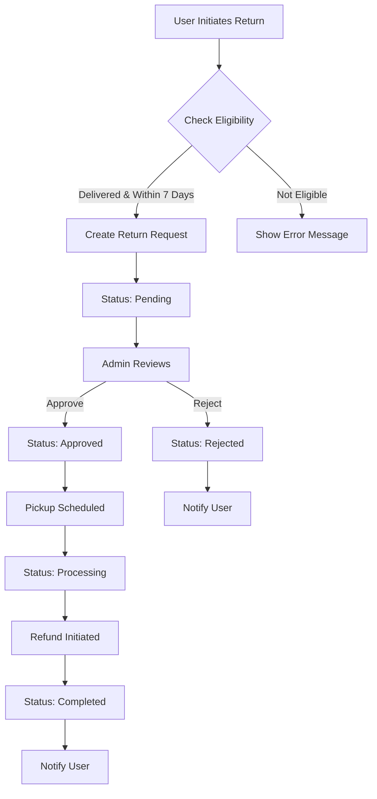
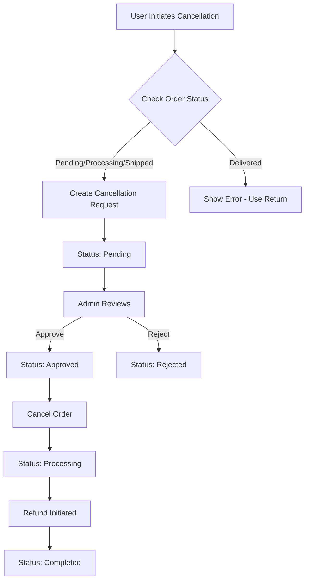
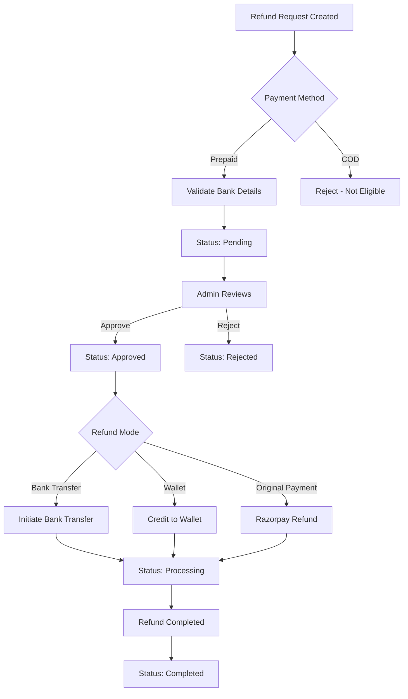

# Return & Refund System Documentation

## Overview

This document provides comprehensive documentation for the Return and Refund management system implemented in the backend. The system handles order returns, cancellations, and refund processing with full admin controls and user notifications.

---

## Table of Contents

1. [Database Schema](#database-schema)
2. [API Endpoints](#api-endpoints)
3. [Business Rules](#business-rules)
4. [Workflow Diagrams](#workflow-diagrams)
5. [Integration Points](#integration-points)
6. [Usage Examples](#usage-examples)

---

## Database Schema

### 1. `refund_requests` Table

Stores refund requests for cancelled prepaid orders.

| Column | Type | Constraints | Description |
|--------|------|-------------|-------------|
| `id` | uuid | PRIMARY KEY | Unique refund request ID |
| `order_id` | uuid | FK → orders | Associated order |
| `user_id` | uuid | FK → users | User requesting refund |
| `refund_amount` | numeric | NOT NULL | Amount to be refunded |
| `refund_type` | varchar | CHECK | `order_cancellation`, `order_return`, `partial_refund` |
| `payment_method` | varchar | CHECK | `prepaid`, `cod` |
| `original_payment_id` | varchar | | Original payment reference |
| `bank_account_holder_name` | varchar | | Beneficiary name |
| `bank_account_number` | varchar | | Bank account number |
| `bank_ifsc_code` | varchar | | IFSC code |
| `bank_name` | varchar | | Bank name |
| `refund_mode` | varchar | CHECK, DEFAULT: `bank_transfer` | `bank_transfer`, `wallet`, `original_payment` |
| `status` | varchar | CHECK, DEFAULT: `pending` | `pending`, `approved`, `processing`, `completed`, `rejected` |
| `admin_notes` | text | | Admin comments |
| `processed_by` | uuid | FK → users | Admin who processed |
| `processed_at` | timestamp | | Processing timestamp |
| `razorpay_refund_id` | varchar | | Razorpay refund reference |
| `created_at` | timestamp | DEFAULT: CURRENT_TIMESTAMP | Creation timestamp |
| `updated_at` | timestamp | DEFAULT: CURRENT_TIMESTAMP | Last update timestamp |

---

### 2. `return_orders` Table

Stores return and cancellation requests.

| Column | Type | Constraints | Description |
|--------|------|-------------|-------------|
| `id` | uuid | PRIMARY KEY | Unique return request ID |
| `order_id` | uuid | FK → orders | Associated order |
| `user_id` | uuid | FK → users | User requesting return |
| `return_type` | varchar | CHECK | `return`, `cancellation` |
| `reason` | varchar | NOT NULL | Return/cancellation reason |
| `additional_details` | text | | Additional information |
| `bank_account_holder_name` | varchar | NOT NULL | Beneficiary name |
| `bank_account_number` | varchar | NOT NULL | Bank account number |
| `bank_ifsc_code` | varchar | NOT NULL | IFSC code |
| `bank_name` | varchar | NOT NULL | Bank name |
| `refund_amount` | numeric | NOT NULL | Calculated refund amount |
| `status` | varchar | CHECK, DEFAULT: `pending` | `pending`, `approved`, `rejected`, `processing`, `completed` |
| `admin_notes` | text | | Admin comments |
| `admin_id` | uuid | FK → users | Admin who processed |
| `processed_at` | timestamp | | Processing timestamp |
| `created_at` | timestamp | DEFAULT: CURRENT_TIMESTAMP | Creation timestamp |
| `updated_at` | timestamp | DEFAULT: CURRENT_TIMESTAMP | Last update timestamp |

---

### 3. `return_order_items` Table

Stores item-level details for partial returns.

| Column | Type | Constraints | Description |
|--------|------|-------------|-------------|
| `id` | uuid | PRIMARY KEY | Unique item ID |
| `return_order_id` | uuid | FK → return_orders | Associated return request |
| `order_item_id` | uuid | FK → order_items | Specific order item |
| `quantity` | integer | DEFAULT: 1 | Quantity being returned |
| `return_reason` | varchar | | Item-specific reason |
| `created_at` | timestamp | DEFAULT: CURRENT_TIMESTAMP | Creation timestamp |

---

## API Endpoints

### Refund APIs

**Base URL:** `/api/refund`

#### 1. Create Refund Request

```http
POST /api/refund/create
Authorization: Bearer <token>
```

**Request Body:**
```json
{
  "orderId": "uuid",
  "refundType": "order_cancellation",
  "bankDetails": {
    "accountHolderName": "John Doe",
    "accountNumber": "1234567890",
    "ifscCode": "SBIN0001234",
    "bankName": "State Bank of India"
  }
}
```

**Response:**
```json
{
  "success": true,
  "message": "Refund request created successfully",
  "refundRequest": {
    "id": "uuid",
    "orderId": "uuid",
    "amount": 1500.00,
    "status": "pending",
    "refundMode": "bank_transfer"
  }
}
```

**Validations:**
- Order must be cancelled
- Order must be prepaid
- No existing refund request for the order
- User must own the order

---

#### 2. Get User Refund Requests

```http
GET /api/refund/my-requests?page=1&limit=10
Authorization: Bearer <token>
```

**Response:**
```json
{
  "success": true,
  "refundRequests": [...],
  "total": 5,
  "page": 1,
  "limit": 10,
  "totalPages": 1
}
```

---

#### 3. Get All Refund Requests (Admin)

```http
GET /api/refund/admin/all?page=1&limit=20&status=pending&refundType=order_cancellation
Authorization: Bearer <admin-token>
```

**Query Parameters:**
- `page` (optional): Page number
- `limit` (optional): Items per page
- `status` (optional): Filter by status
- `refundType` (optional): Filter by refund type

**Response:**
```json
{
  "success": true,
  "refundRequests": [
    {
      "id": "uuid",
      "order": {...},
      "user": {...},
      "refund_amount": 1500.00,
      "status": "pending",
      "created_at": "2025-12-24T10:00:00Z"
    }
  ],
  "total": 50,
  "page": 1,
  "limit": 20,
  "totalPages": 3
}
```

---

#### 4. Update Refund Status (Admin)

```http
PUT /api/refund/admin/update-status/:id
Authorization: Bearer <admin-token>
```

**Request Body:**
```json
{
  "status": "approved",
  "adminNotes": "Refund approved after verification"
}
```

**Valid Statuses:**
- `pending`
- `approved`
- `processing`
- `completed`
- `rejected`

**Response:**
```json
{
  "success": true,
  "message": "Refund request approved successfully"
}
```

---

### Return Order APIs

**Base URL:** `/api/return-orders`

#### 1. Check Return Eligibility

```http
GET /api/return-orders/eligibility/:order_id
```

**Response:**
```json
{
  "success": true,
  "order_status": "delivered",
  "eligibility": {
    "can_return": true,
    "can_cancel": false,
    "reason": "Product can be returned within 7 days of delivery. 5 days remaining.",
    "days_since_delivery": 2
  }
}
```

---

#### 2. Create Return Request

```http
POST /api/return-orders/create
```

**Request Body:**
```json
{
  "order_id": "uuid",
  "user_id": "uuid",
  "return_type": "return",
  "reason": "Product damaged",
  "additional_details": "Box was damaged during shipping",
  "bank_account_holder_name": "John Doe",
  "bank_account_number": "1234567890",
  "bank_ifsc_code": "SBIN0001234",
  "bank_name": "State Bank of India",
  "items": [
    {
      "order_item_id": "uuid",
      "quantity": 1,
      "reason": "Damaged product"
    }
  ]
}
```

**Response:**
```json
{
  "success": true,
  "return_order": {...},
  "message": "Return request created successfully"
}
```

**Validations:**
- All required fields must be provided
- Order must belong to user
- Order must be eligible (within 7 days for returns, or in pending/processing/shipped for cancellations)
- No existing return request

---

#### 3. Get User Return Requests

```http
GET /api/return-orders/user/:user_id?limit=10&offset=0
```

**Response:**
```json
{
  "success": true,
  "return_requests": [
    {
      "id": "uuid",
      "order_id": "uuid",
      "return_type": "return",
      "status": "pending",
      "refund_amount": 1450.00,
      "created_at": "2025-12-24T10:00:00Z"
    }
  ]
}
```

---

#### 4. Get Return Request Details

```http
GET /api/return-orders/details/:id
```

**Response:**
```json
{
  "success": true,
  "return_request": {
    "id": "uuid",
    "order_id": "uuid",
    "return_type": "return",
    "reason": "Product damaged",
    "status": "pending",
    "refund_amount": 1450.00,
    "return_items": [
      {
        "id": "uuid",
        "order_item_id": "uuid",
        "quantity": 1,
        "return_reason": "Damaged product"
      }
    ]
  }
}
```

---

#### 5. Get All Return Requests (Admin)

```http
GET /api/return-orders/admin/all?limit=50&offset=0&status=pending
```

**Response:**
```json
{
  "success": true,
  "return_requests": [...]
}
```

---

#### 6. Update Return Status (Admin)

```http
PUT /api/return-orders/admin/status/:id
```

**Request Body:**
```json
{
  "status": "approved",
  "admin_notes": "Return approved. Pickup scheduled.",
  "admin_id": "uuid"
}
```

**Valid Statuses:**
- `pending`
- `approved`
- `rejected`
- `processing`
- `completed`

**Response:**
```json
{
  "success": true,
  "return_request": {...},
  "message": "Return request updated successfully",
  "notification_sent": true
}
```

---

#### 7. Delete Return Request (Admin)

```http
DELETE /api/return-orders/admin/delete/:id
Authorization: Bearer <admin-token>
```

**Response:**
```json
{
  "success": true,
  "message": "Return request deleted successfully"
}
```

---

## Business Rules

### Return Eligibility Rules

#### For Returns:
- ✅ Order status must be `delivered`
- ✅ Return must be requested within **7 days** of delivery
- ✅ Days calculated from `updated_at` (delivery date) or `created_at`
- ❌ Cannot return after 7-day window expires

#### For Cancellations:
- ✅ Order status must be `pending`, `processing`, or `shipped`
- ❌ Cannot cancel delivered orders

#### Duplicate Prevention:
- ❌ Cannot create multiple return requests for the same order

---

### Refund Calculation

#### For Cancellations:
```javascript
refund_amount = order.total  // Full refund
```

#### For Returns:
```javascript
refund_amount = order.total - order.shipping  // Shipping not refunded
```

---

### Refund Eligibility Rules

- ✅ Only **prepaid** orders are eligible for refunds
- ✅ Only **cancelled** orders can request refunds
- ❌ COD orders cannot request refunds
- ❌ Active orders cannot request refunds

---

### Status Workflow

#### Refund Status Flow:
```
pending → approved → processing → completed
                  ↘ rejected
```

#### Return Status Flow:
```
pending → approved → processing → completed
                  ↘ rejected
```

---

## Workflow Diagrams

### Return Request Workflow



---

### Cancellation Request Workflow



---

### Refund Processing Workflow



---

## Integration Points

### 1. Wallet Integration

The refund system integrates with the wallet system for wallet-based refunds.

**File:** `controller/walletController.js`

**Function:** `processRefundToWallet`

**Endpoint:** `POST /api/wallet/refund`

**Request:**
```json
{
  "user_id": "uuid",
  "amount": 1500.00,
  "refund_request_id": "uuid",
  "description": "Order refund"
}
```

**Features:**
- Validates refund amount
- Checks for duplicate refunds
- Credits wallet balance
- Creates transaction record
- Sends notification to user

---

### 2. Notification System

Both systems create notifications for users and admins.

**File:** `controller/NotificationHelpers.js`

**Functions:**
- `createRefundNotification(user_id, order_id, status, amount)`
- `createAdminRefundNotification(order_id, userName, amount, refundType)`
- `createReturnNotification(user_id, order_id, status, return_type)`
- `createAdminReturnNotification(order_id, userName, return_type)`

**Notification Types:**
- User notifications: Status updates, approvals, rejections
- Admin notifications: New requests, pending reviews

---

### 3. Razorpay Integration

The system is ready for Razorpay refund integration.

**Field:** `razorpay_refund_id` in `refund_requests` table

**Usage:**
```javascript
// Store Razorpay refund ID after successful refund
await supabase
  .from('refund_requests')
  .update({ 
    razorpay_refund_id: refundResponse.id,
    status: 'processing'
  })
  .eq('id', refundRequestId);
```

---

## Usage Examples

### Example 1: User Checks Return Eligibility

```javascript
// Frontend code
const checkEligibility = async (orderId) => {
  const response = await fetch(`/api/return-orders/eligibility/${orderId}`);
  const data = await response.json();
  
  if (data.eligibility.can_return) {
    console.log(data.eligibility.reason);
    // Show return form
  } else if (data.eligibility.can_cancel) {
    console.log(data.eligibility.reason);
    // Show cancellation form
  } else {
    console.log(data.eligibility.reason);
    // Show error message
  }
};
```

---

### Example 2: User Creates Return Request

```javascript
const createReturn = async (returnData) => {
  const response = await fetch('/api/return-orders/create', {
    method: 'POST',
    headers: {
      'Content-Type': 'application/json',
    },
    body: JSON.stringify({
      order_id: returnData.orderId,
      user_id: returnData.userId,
      return_type: 'return',
      reason: returnData.reason,
      additional_details: returnData.details,
      bank_account_holder_name: returnData.bankDetails.holderName,
      bank_account_number: returnData.bankDetails.accountNumber,
      bank_ifsc_code: returnData.bankDetails.ifscCode,
      bank_name: returnData.bankDetails.bankName,
      items: returnData.items // For partial returns
    })
  });
  
  const result = await response.json();
  if (result.success) {
    console.log('Return request created:', result.return_order.id);
  }
};
```

---

### Example 3: Admin Approves Return

```javascript
const approveReturn = async (returnId) => {
  const response = await fetch(`/api/return-orders/admin/status/${returnId}`, {
    method: 'PUT',
    headers: {
      'Content-Type': 'application/json',
      'Authorization': `Bearer ${adminToken}`
    },
    body: JSON.stringify({
      status: 'approved',
      admin_notes: 'Return approved. Pickup scheduled for tomorrow.',
      admin_id: currentAdminId
    })
  });
  
  const result = await response.json();
  if (result.success) {
    console.log('Return approved and notification sent');
  }
};
```

---

### Example 4: Process Refund to Wallet

```javascript
const processWalletRefund = async (refundData) => {
  const response = await fetch('/api/wallet/refund', {
    method: 'POST',
    headers: {
      'Content-Type': 'application/json',
    },
    body: JSON.stringify({
      user_id: refundData.userId,
      amount: refundData.amount,
      refund_request_id: refundData.refundRequestId,
      description: 'Order refund'
    })
  });
  
  const result = await response.json();
  if (result.success) {
    console.log('Refund credited to wallet');
  }
};
```

---

## Error Handling

### Common Error Responses

#### 400 Bad Request
```json
{
  "success": false,
  "error": "Order is not eligible for this type of request"
}
```

#### 404 Not Found
```json
{
  "success": false,
  "error": "Order not found or doesn't belong to user"
}
```

#### 403 Forbidden
```json
{
  "success": false,
  "error": "Unauthorized to create refund for this order"
}
```

#### 500 Internal Server Error
```json
{
  "success": false,
  "error": "Internal server error"
}
```

---

## Testing

### Test Database Connection

```http
GET /api/return-orders/test
```

**Response:**
```json
{
  "success": true,
  "message": "Database connection test",
  "tables": {
    "return_orders": {
      "exists": true,
      "error": null,
      "count": 15
    },
    "notifications": {
      "exists": true,
      "error": null,
      "count": 120
    }
  }
}
```

---

## Security Considerations

1. **Authentication Required:**
   - All user endpoints require valid JWT token
   - Admin endpoints require admin role verification

2. **Authorization:**
   - Users can only access their own refund/return requests
   - Order ownership verified before creating requests

3. **Data Validation:**
   - All input fields validated
   - Bank details format validation
   - Status transitions validated

4. **Idempotency:**
   - Duplicate refund/return requests prevented
   - Wallet transactions use idempotency keys

---

## Future Enhancements

- [ ] Automatic Razorpay refund processing
- [ ] Inventory restoration on completed returns
- [ ] Partial refund support
- [ ] Return shipping label generation
- [ ] Automated pickup scheduling
- [ ] Return quality inspection workflow
- [ ] Refund analytics dashboard
- [ ] Email notifications for status updates
- [ ] SMS notifications for critical updates
- [ ] Return tracking integration

---

## Support

For issues or questions regarding the Return & Refund system, please contact the development team or refer to the main project documentation.

**Last Updated:** December 24, 2025
